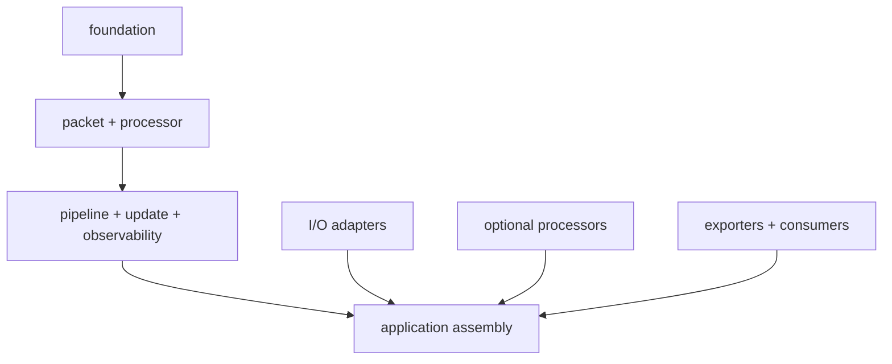

# Proposed Repository Layout

```text
/
├── build.zig
├── build.zig.zon
├── src/
│   ├── root.zig                 public package surface
│   ├── foundation/              identifiers, budgets, errors, time
│   ├── packet/                  views, editors, parsers, checksums
│   ├── processor/               native processor contract and capabilities
│   ├── pipeline/                compile-time composition and batch execution
│   ├── update/                  candidates, generations, QSBR, rollback
│   ├── observability/           registry, worker cells, snapshots, events
│   ├── state/                   optional bounded state primitives
│   ├── policy/                  optional standard policy processor
│   ├── testing/                 synthetic backend and deterministic harness
│   ├── io/
│   │   ├── contract.zig
│   │   ├── synthetic/
│   │   ├── pcap/
│   │   ├── dpdk/
│   │   └── af_xdp/
│   ├── exporters/
│   │   └── prometheus/
│   └── consumers/
│       ├── binary_file/
│       └── jsonl_debug/
├── examples/
│   ├── static_filter/
│   ├── hot_update/
│   └── policy_firewall/
├── test/
│   ├── conformance/
│   ├── integration/
│   ├── property/
│   ├── fuzz/
│   ├── fixtures/
│   └── hardware/
├── bench/
│   ├── micro/
│   ├── replay/
│   ├── end_to_end/
│   ├── baselines/
│   └── schemas/
├── models/
│   └── tla/
├── docs/
│   ├── user/
│   ├── api/
│   ├── internals/
│   ├── adr/
│   ├── compatibility/
│   └── requirements/
├── tools/
│   ├── benchctl/
│   ├── artifact_inspect/
│   └── policy_check/
└── ci/
    ├── images/
    └── hardware/
```

## Dependency direction

`foundation` has no framework dependencies. `packet` and `processor` depend only on `foundation`. `pipeline`, `update`, and `observability` depend on those contracts but not on a concrete I/O adapter. Optional processors (`policy`, stateful processors, BPF/Wasm later) consume the same public processor contract. Adapters may depend inward; the core must never import outward from an adapter.



## Package policy

The repository is one Zig package during Phases 1-4, with optional modules controlled by build imports. Split packages only if independent release cadence or dependency weight becomes real. Premature package splitting would create version coordination without improving the public boundary.

The DPDK and AF_XDP adapters may live in the same repository but produce separate build modules so an application that uses neither has no C, kernel-header, libbpf, or huge-page dependency.

