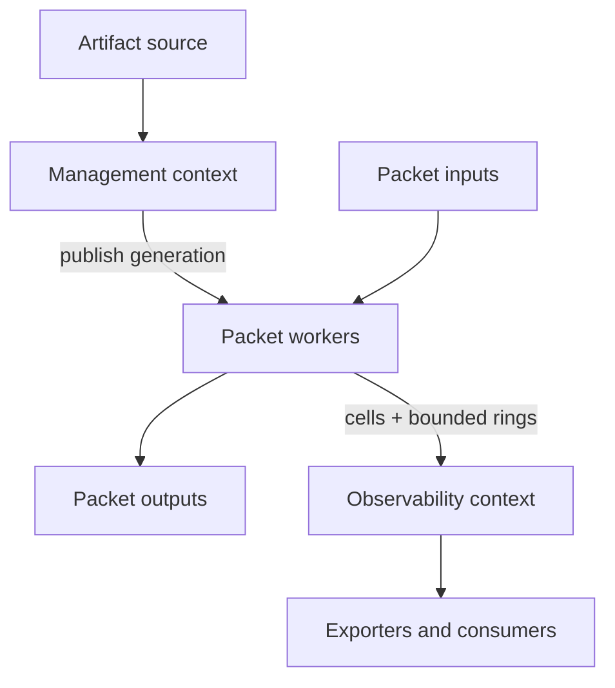

# System Architecture

## Responsibility topology

The framework contains three execution contexts, not three services:

1. **Packet workers** poll inputs and process batches under strict bounded-work rules.
2. **Management context** receives artifacts, prepares and validates candidate generations, publishes them, and reclaims retired generations.
3. **Observability context** snapshots worker metrics and drains event rings into application-selected consumers.

An application may run all three in one process. Moving management or observability to another process is an adapter/deployment concern and does not change processor semantics. There is no packet-to-controller decision RPC.

## Hot and cold boundaries

| Operation | Context | May allocate? | May block/I/O? | Failure form |
| --- | --- | --- | --- | --- |
| Receive/process/transmit | Packet worker | Only from declared bounded pools | No | Bounded status and configured disposition |
| Processor preparation | Management | Yes, under budget | Yes, local | Structured diagnostic; active generation unchanged |
| Worker instantiation | Management/startup; never concurrently on target worker | Yes, under worker budget | No remote I/O | Candidate fails before publication |
| Generation publication | Management + batch-boundary worker load | No | No | Previous generation remains active or explicit fatal state |
| Snapshot/export | Observability | Yes | Yes | Exporter-local failure |
| Event emit | Packet worker | No | No | accepted, sampled, or overflowed |
| Event consume | Observability | Yes | Yes | Consumer-local failure |

## Primary data flow

At each worker loop:

1. Reclaim completed TX buffers and refill input-specific ownership structures.
2. Receive up to `max_batch` descriptors. A non-empty partial batch proceeds immediately.
3. Acquire the published generation once. Record it in the batch.
4. Adapt descriptors into preallocated packet slots. No payload copy is allowed.
5. Initialize the active selection and per-batch dispositions.
6. Call each processor once with the whole batch. Processors iterate/select as appropriate.
7. Validate/finalize mutations and resolve every remaining `Continue` through the application's default completion policy.
8. Group terminal packets into preallocated output bursts and submit them.
9. Return dropped/completed storage to the owning backend and retain only packets whose explicit retention contract succeeded.
10. Update progress and report the batch boundary as quiescent.

The loop may poll multiple assigned queues only if a benchmark shows that this is better for the deployment. A queue still has one worker owner.

## Public versus internal stability

Publicly stable concepts are packet access semantics, selection/disposition semantics, processor lifecycle, artifact identity, update atomicity, observability descriptors, and failure outcomes. Internal packet slot layout, bitset word width, QSBR token layout, lookup algorithms, and adapter C shims are not stable.

No public type embeds `rte_mbuf`, `xdp_desc`, a file descriptor, a C allocator, or a concrete metrics protocol. Backend-native escape hatches are namespaced as unsafe adapter capabilities and are never required by a conforming processor.

## Capability model

Each processor declares at comptime:

- packet access: metadata-only, read, structured-edit, raw-edit;
- possible dispositions and output identifiers;
- monotonic-time use;
- registered state facilities;
- bounded metric and event schemas;
- metadata fields produced/consumed;
- artifact requirement and content types;
- worker/prepared resource estimate functions.

Application assembly computes the union, rejects unavailable capabilities, creates exact worker scratch layouts, and generates the pipeline. The processing context exposes only declared facilities. This is a Zig type/capability boundary, not a security sandbox: native processors are trusted code, but accidental access is restricted and unsafe code is visible.

## Extensibility rule

Extensibility happens by implementing one of a small set of behavioral contracts: processor, input, output, artifact source, metrics exporter, or event consumer. New executor technologies are processors. New transports for management are sources. New protocols for metrics are exporters. This is narrower and more stable than a generic component/plugin interface.

