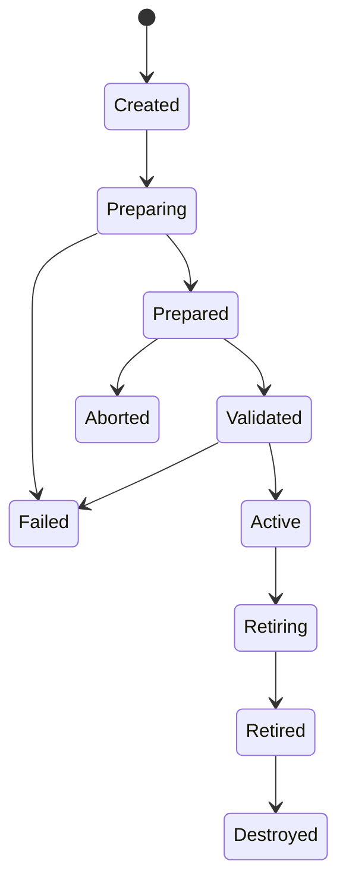

# Concurrency, Generations, and Updates

## Objects

`PreparedGeneration` owns immutable prepared processor data, generation-scoped descriptor tables, resource accounting, and compatibility metadata. Worker-local processor objects are created for the candidate before publication or use a generation-indexed immutable reference plus preallocated compatible worker state.

The publication slot contains `{pointer, generation_id, epoch}` logically. If a single atomic cannot represent it portably, the pointer targets an immutable header containing ID and epoch; only the pointer is atomic.

## Publication protocol

1. Management creates a candidate arena and prepares all changed processor parts.
2. It reuses an old immutable part only if that processor explicitly declares compatibility and shared ownership.
3. It computes exact/upper-bound resources, instantiates every worker part, validates cross-processor capabilities, and runs candidate self-tests.
4. It assigns a monotonic local generation ID and publication epoch.
5. A release store publishes the complete generation pointer.
6. At the next batch boundary, each online worker performs an acquire load. It uses that pointer for the entire batch.
7. The previous generation enters the retirement FIFO with its publication/grace token.
8. After every worker that could have referenced it has reported a later quiescent state or gone offline safely, management destroys worker parts, then prepared data, then the arena.

Workers can adopt at different boundaries, but one batch never mixes generations. Activation completion and universal worker adoption are distinct statuses in observability.

## QSBR details

Each registered worker has a cache-line-separated state:

```text
registered, online, last_quiescent_epoch, progress_counter
```

The worker reports a quiescent epoch after releasing all batch, generation, packet, and generation-owned state references. Going offline is allowed only at the same condition. A stalled online worker prevents reclamation but not publication or other packet workers. Retained-generation budget then provides backpressure: further updates are rejected, coalesced, or the application invokes a documented stalled-worker policy. Old memory is never reclaimed merely because a timeout elapsed.

The initial implementation supports one writer/serialized update runtime. Multiple concurrent update preparers may exist, but activation is serialized. A multi-writer lock-free publication protocol offers no product value here.

## Rollback

Rollback creates a new generation identity whose prepared parts refer to a retained compatible generation. It is not pointer time travel: activation, metrics, audit, state policy, and QSBR proceed normally. Rollback validation rechecks resources and worker compatibility because worker state may have changed since the target was active.

## State transitions



## Memory ordering proof obligations

- An acquiring worker that observes the new pointer observes all generation initialization.
- A generation is immutable after publication except explicitly separate worker-local state.
- A worker reports epoch `E` only after it can no longer dereference any generation retired before or at `E`.
- Management frees a retired generation only after all relevant registered online workers satisfy the grace condition.
- Registration and online/offline transitions cannot let a worker acquire an untracked old reference.
- Shutdown unregisters a worker only after it is quiescent.

These properties are modeled in `models/tla/GenerationQSBR.tla` before M6 implementation. TLC explores two generations, up to three workers, publication, batch start/end, online/offline, rollback, worker stall, and shutdown. Code tests add deterministic scheduler hooks to force the corresponding interleavings.

## Failure policy

Preparation and validation failures destroy the candidate and leave publication untouched. A store/pointer publication should not fail; failures immediately before it leave the prior generation active. A fatal invariant after publication is never silently rolled back because some workers may have observed the new generation; the runtime enters an explicit fatal state or completes a new rollback activation according to application policy.

